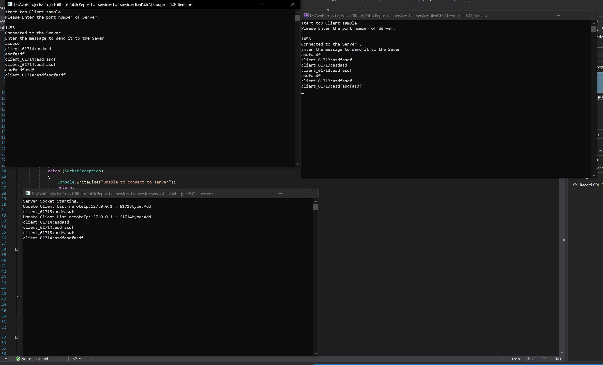

# chat-service

#### The chat-service project is a multi-client console base chat application with socket packages as pur.

#### Installing and Run

#### To run the project, use the multi startup feature via visual studio and set two console libraries as the starter project.

#### Enter the port number to connect to the server from the client terminal that is opened, I embedded it in the code as port 1453.

#### To connect the second client, run the client project via visual studio or the compiled debug in the bin folder and connect it to the server in the same way.
#### Below is a sample working scenario, you can review and add more clients.

